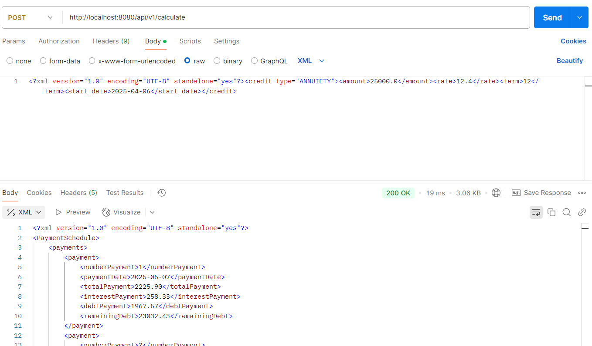

# Описание

На основе библиотеки 2 нужно реализовать веб приложение.  Сервлет, который принимает пост запрос с параметрами платежа и  возвращает результат расчета. Сборка maven, приложение деплоится на Tomcat.

# Решение

Для обслуживания запросов создан сервлет, который запускается в Tomcat embedded на порту 8080. Сервлет делегирует обработку
сущности DispatcherHandlerRequest, который знает о существовании остальных обработчиков в пакете handlers. Сервлет способен выдавать результат
ошибки в xml.

# Запуск

Клонировать, перейти в корень проекта:

```
mvn clean install
```

Или:

```
docker run -p 8080:8080 munirsunchlyaev/task5
```

# Скриншоты запуска




